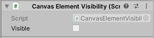

# CanvasElementVisibility
Easily hide/show Unity Canvas elements.

# Usage
## Unity Editor
Add the CanvasElementVisibility component script to the game object you want to hide/show and toggle the *Visible* property to change its visibility.



## Code
```csharp
gameObject.GetComponent<CanvasElementVisibility>().Visible = true;
```
